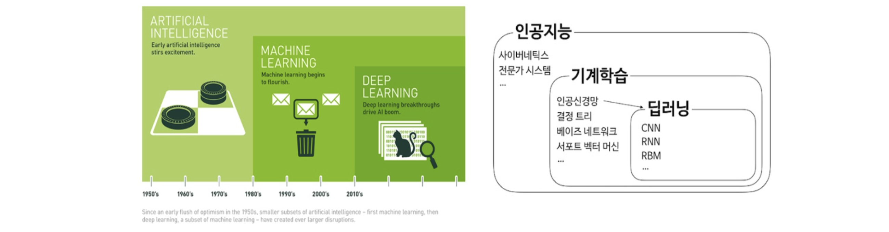
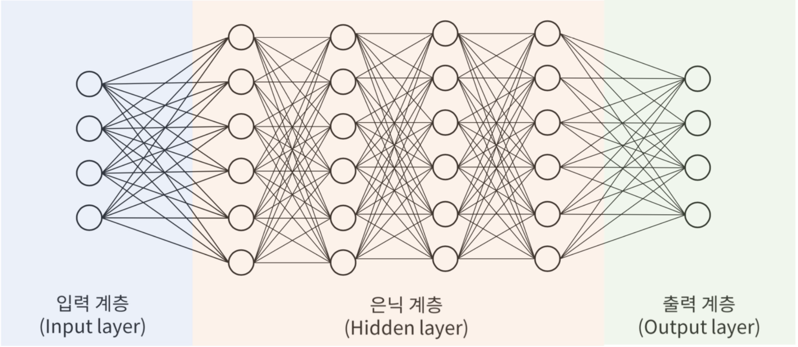

# Lec 0. 데이터로 그리는 미래 지도

## 인공지능
- 4차 산업혁명은 data의 시대   
    - 데이터 처리 기술의 급격한 발전과 활용도 증대
    - 무의미해진 산업간 경졔로 인한 비지니스 모델의 변화
    - 인공지능 주도형 생산 및 서비스 시대의 돌입

**인공지능의 분류**
- `인공지능(AI)`, `머신러닝(ML)`, `딥러닝(DL)`
    - AI: 인공적으로 구현한 모든 수준의 지능
    - ML: 스스로 학습하여 임무를 수행할 수 있는 능력을 컴퓨터가 갖도록 구현하는 ai의 한 분야
    - DL: 머신러닝을 실현하기 위한 기술, 데이터에 대한 다층적 표현과 추상화를 통해 학습



## 딥러닝

**`인공신경망`**
- 생물학의 신경망에서 영감을 얻은 통계학적 학습 알고리즘
- 출력을 추정하는 과정에서 입력값의 중요도에 따라 가중치를 부여하는 방법이 필요

**`심층신경망(=딥러닝)`**
- 입력층, 은닉층, 출력층의 구조

- z1 = w0 + w1x1 + w2x2
    - w1, w2: 가중치(선), 각 층마다 z값이 나옴

**머신러닝과 딥러닝**
~~~
머신러닝은 지도학습, 딥러닝은 비지도 학습
~~~
- 딥러닝 모형은 계층적 표현 학습모형
- 층별로 학습에서의 역할이 다름
- 이미지의 기초 -> 추상적인 부분으로 살펴봄
- 계산 하나하나는 단순하고 성능이 낮지만, 넓고 깊게 연결되면 고도의 지능적 판단이 가능
- 입력데이터로부터 바로 결과에 이르는 중단 학습이 가능

**딥러닝 발전의 배경**
1. 빅데이터의 출현
- 인터넷, 스마트폰 관련 서비스의 확산에 따른 대량의 데이터 축적 
- 이미지넷과 같이 머신러닝을 위한 데이터의 축적 등
    - 데이터는 딥러닝 모형의 훈련을 위한 연료 역할

2. 컴퓨팅 하드웨어의 개선
- CPU, GPU, 메모리 등이 빠른 속도로 발전
- GPU는 행렬연산과 같은 대량의 데이터를 병렬연산핤 수 있어서 계산속도가 CPU보다 빠름
- 층이 깊으면 대규모 행렬연산이 늘어나서 CPU보다 GPU 성능에 의존하게 됨

3. 딥러닝 관련 새로운 알고리즘 개발
- ReLU와 같은 활성화 함수 도입

    - **`활성화 함수`란?**  
> - 신경망에서 각 뉴런이 입력값을 받아 출력값으로 바꿔주는 규칙  
> - 활성화 함수를 사용하면 **비선형성**이 생겨 복잡한 패턴을 학습할 수 있음  

주요 활성화 함수 예시
```text
Sigmoid : 0 ~ 1 사이 값 → 확률 해석 가능
ReLU    : max(0, x) → 단순하고 효율적
tanh    : -1 ~ 1 사이 값 → 중심이 0, 학습 안정적
```
- 초기 가중치의 변화
    - 신경망 학습 시작할 때 각 연결을 무작위로 초기화
    - 개선된 초기화 방법: Xavier, He
- 배치 정규화
    - 층별 출력 분포를 안정화 -> 학습 속도와 성능 개선
- Adam과 같은 경사하강법의 개선 등 

## EDA
- 탐색적 데이터 분석
1. 목적
- 데이터 구조, 품질, 이상치 확인 
- 변수 간 관계, 패턴, 가설 아이디어 발견
- 모델링, 가공 전략 수립 근거 마련

2. 방법
- 요약통계
- 시각화
- 비지니스/도메인 맥락 결합 해석

## 초거대언어모델

**자연어 처리**
- 인간의 언어 현상을 컴퓨터로 이용하여 모사할 수 있도록 연구하고 구현하는 인공지능의 주요분야
- `언어모델`: 문장을 구성하는 단어들이 나타날 **확률을 알고 있다면** 단어를 적절하게 선택하거나 문장을 순차적으로 생성해야 하는 경우 여러 후보 단어들 중에서 **가장 그럴 듯한 단어를 선택**할 수 있음

**언어이해 모델**
- 대용량 데이터에서 단어의 문맥을 사전 학습하여 입력문장에 포함된 단어의 문법과 의미를 이해하는 모델
    - BERT, 기계독해, 문서 분류, 언어 분석 등

**언어생성 모델**
- 대용량 데이터를 미리 학습하여 주어진 단어 열에 가장 적합한 다음 단어를 예측하는 모델
    - GPT, 문장 자동완성, 자동번역, 문장 요약, 대화/챗봇, 스토리 생성 등

**(초)거대언어모델의 정의**
- 기본적으로 언어생성 모델과 동일
- 대용량 연산이 가능한 인프라를 기반으로 데이터 학습
- 모델이 학습해야 할 매개변수가 일반적으로 1,000억 개를 넘을 경우 초거대 언어모델이라고 분류


