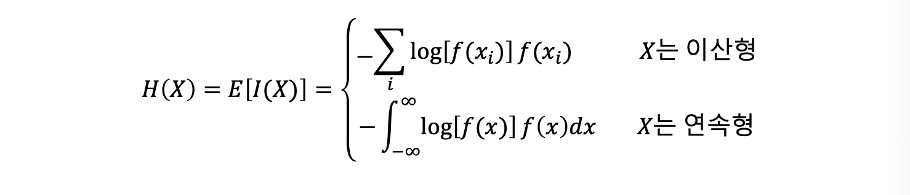
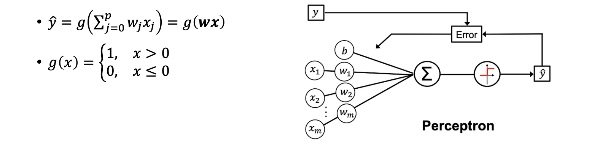
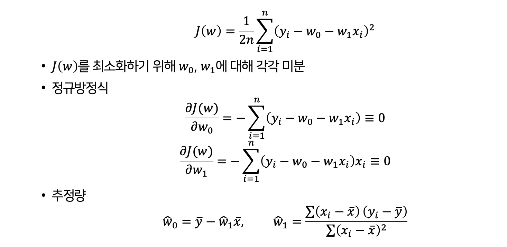
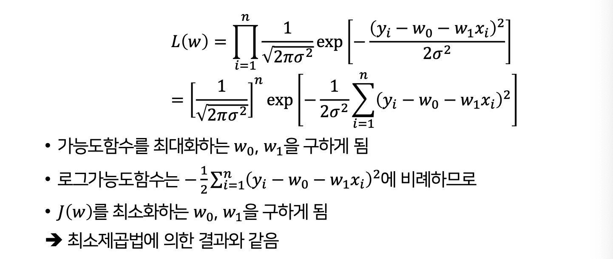
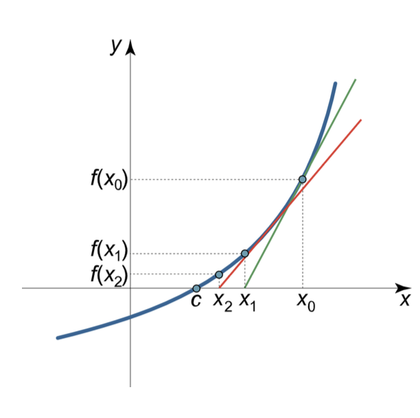
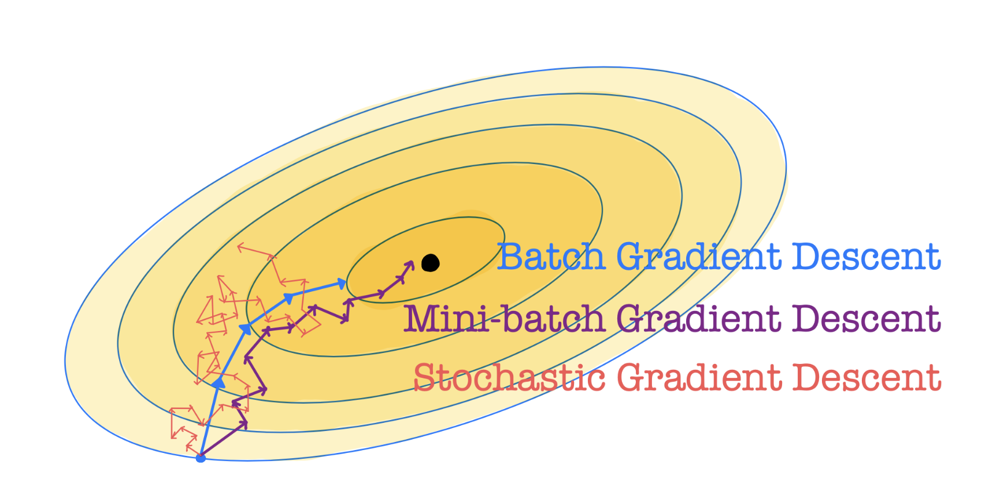
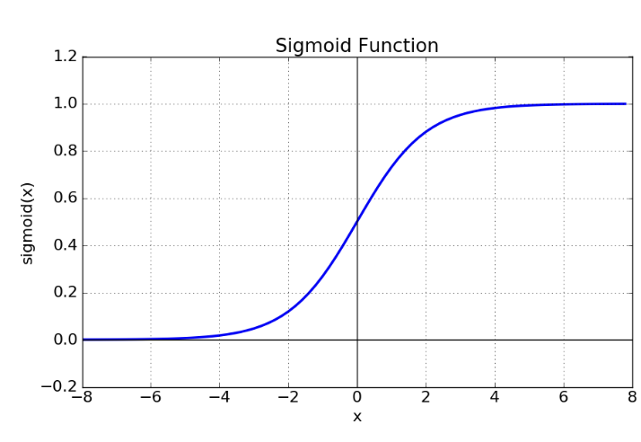

# LEC 1. 딥러닝과 통계학

## 통계학과 머신러닝 
`통계학`
- 모집단의 범주(함수 유형)을 한정하고 여러가지 가정과 공정한 절차 체계를 구축하고 이를 기반으로 알지 못하는 모집단의 세계를 소수의 데이터로 추정
- 컴퓨팅 능력이 향상되면서, 수리적 절차 중심 통계학 체제의 알고리즘 기반으로 점차 변하고 있음 
- 확률모형 방법에서 점차 데이터 기반으로 변화

| 통계학          | 모수   | 추정, 적합 | 회귀, 분류 | 군집화, 분포추정 | 독립(설명) 변수 | 종속(반응) 변수 |
|-----------------|--------|------------|------------|------------------|-----------------|-----------------|
| 딥러닝, 머신러닝 | 가중치 | 학습       | 지도학습   | 비지도학습       | 특징            | 레이블          |

- 통계모형: 확률분포 기반으로 추정과 가설검정을 통해 왜 이러한 결과가 발생했는지 설명하는 것이 주 목적
- 딥러닝 모형: 과정은 알 수 없고 예측만이 목적, 입력변수의 숫자가 매우 많음 

`전통적 통계모형`
- 생성구조를 나타내는 모형과 오차항으로 구성
    - 오차항: 특정 확률분포를 따르고 어떤 분포를 이용하는가가 주요 관심사 
- 잔차: 모형을 추정한 후 구한 실젯값과 추정값의 차이, 오차항의 추정값   
    - 잔차가 임의적(패턴이 없음)이면 통계모형을 더이상 개선하기 어렵다고 판단

`딥러닝 모형`
- 데이터를 훈련/시험 데이터로 나누고 훈련 데이터로 효율적으로 학습시킨 후 시험 데이터에서 예측력이 얼마나 좋은지가 주요 관심사
- 변수를 선택하지 않지만, 모형을 선택
    - 한 레이어에 몇 개가 들어갈 건지, 은닉층의 갯수 등
- 하이퍼 파라미터 튜닝을 통해 최적의 값을 정함  
    - 손실함수를 가장 적게 만드는 과정 

| 구분        | 전통적 통계모형                              | 딥러닝 모형                                  |
|-------------|---------------------------------------------|---------------------------------------------|
| 데이터 크기 | 소규모                                      | 대규모                                      |
| 모형의 구조 | 데이터 = 생성구조 + 오차                    | 오차가 주요 문제가 아님                      |
| 모형의 크기 | 데이터 생성구조를 저차원 모형으로 파악       | 데이터 생성구조가 복잡 → 고차원 모형         |
| 모형의 평가 | 적합도, 유의성                              | 예측력                                      |
| 모형의 작성 | 생성구조를 오차에서 분리                     | 학습을 통해 데이터의 복잡한 특성을 이해       |

**확률분포**
- 신경망에서 이용되는
    - 이산형 확률변수의 확률분포: 베르누이 분포, 멀티누이 분포
    - 연속형 확률변수의 확류분포: 정규분포

## 확률과 정보량
- 확률: 어떤 사건이 일어날 가능성을 0과 1 사이의 숫자로 표현
    - 확률값이 0에 가까운 사건 = 일어나기 어려운 사건 (*포아송분포*)
- 확률값이 작아지면 정보량은 커지고 확률값이 커지면 정보량은 작아짐
- 기댓값 𝜇와 분산 𝜎^2


- `엔트로피(entropy)`: 정보량의 기댓값

- 엔트로피는 불확실성을 측정하는 지표 
- 엔트로피가 작으면 특정 사건이 발생할 가능성이 높다는 것을 의미


## 퍼셉트론과 아달린

`퍼셉트론`
- 가장 기본적인 인공신경망(딥러닝의 뿌리), 선형 이진 분류기
- 동작원리 
    - 입력변수: 𝑥1, 𝑥2, … , 𝑥p / 상수항: 𝑥0 = 1
    - 가중치: 각 입력변수에는 중요도를 나타내는 𝑤1, 𝑤2, … , 𝑤p가 곱해짐
    - 합산: w𝑥 = ∑wj​xj
    - 활성화 함수: 그 합이 0보다 크면 1, 0보다 작거나 같으면 0 -> 단순한 선형분류기 역할을 함
- 학습 방법(퍼셉트론 학습 규칙)
    - 스스로 가중치 w들을 조정하면서 "정답과 최대한 일치"하도록 배움
    - 손실함수를 정하지 않고 가중치를 갱신
        - 손실함수: 모델이 얼마나 틀렸는지 측정하는 함수
    - 초기화: w를 아무 값이나 설정 
    - 예측: 현재 가중치로 입력을 넣어 결과(0, 1)를 계산
    - 오차 계산: 실제 정답 y와 예측값 y_hat의 차이, e = y-y_hat
    - 가중치 업데이트: wj​←wj​+ηexj​ / η = 학습률(한 번에 얼만큼 수정할지 정하는 값)


`아달린`
- 퍼셉트론의 단점(손실함수 정의x)을 극복할 수 있는 기계
- 수식은 퍼셉트론과 같으나 **가중치를 갱신하는 방법이 다름**
- 동작원리
    - 입력값+가중치 합산(퍼셉트론과 동일): z(i) = ∑wj​xj(i)​
    - 출력값 계산: 아달린은 선형 활성화함수 사용 𝜎(z) = z -> 실수값 출력 
    - 손실함수 계산(제곱 오차): J(w) = 1/2*​∑​(y(i)−z(i))^2
    - 가중치 업데이트: wj​ <- wj​+ηe(i)xj(i) / η: 학습률
- 왜 퍼셉트론보다 좋은가?
    - 아달린은 오차를 연속적인 값으로 계산 -> 경사하강법을 통해 부드럽게 가중치를 조정

```
퍼셉트론: 시험에서 "합격/불합격"만 보고 공부방향 정함 -> 정보가 적어서 비효율적
아달린: 시험에서 "점수 차이"까지 알려줌 -> 부족한 정도를 반영해서 더 정밀하게 공부 가능
``` 

| 항목       | 퍼셉트론                                   | ADALINE                                      |
|------------|--------------------------------------------|----------------------------------------------|
| 출력       | 계단함수 (0/1 또는 ±1)                     | 선형 (연속값)                                |
| 손실       | 퍼셉트론 기준 (오분류에만 반응)            | MSE (모든 오차에 연속적으로 반응)            |
| 업데이트   | 오분류 시에만 가중치 변경                  | 오차 크기 비례로 항상 미세 조정              |
| 수학적 성격| 비미분 가능 목표, 수렴 정리는 "선형분리 시"| 미분 가능 목표, 선형회귀와 동일한 해(Wiener 해) 지향 |
| 실무 감각  | 경계만 맞추려 함                          | 경계 및 마진/잔차까지 고려 → 더 안정적       |


## 선형 회귀모형

`선형 회귀모형`
- 설명변수들로 **종속변수를 선형적으로 예측**하는 데 이용되는 모형
- 𝑦i = 𝑤0 + 𝑤1𝑥i + 𝜀i, 𝜀i~𝑁(0, 𝜎^2)
- 오차항은 서로 동독립 정규분포 
- 추정 방법
    - 최소제곱법, 최대가능도추정법

**최소제곱법**


**최대가능도추정법**


`신경망 표현`

- g가 선형인 신경망
- 미분을 통해 가중치의 최적값을 구할 수 있기 때문에 알고리즘 방식으로 가중치를 구할 필요 없음


## 최적화 방법
- 뉴턴의 방법, 경사하강법, 확률적 경사하강법(SGD), 미니배치 경사하강법 

`뉴턴의 방법`
- 함수 **g(x)의 미분이 0이 되는 값**을 찾는 방법
- 𝑓(𝑥) = 𝑔'(𝑥) = 0을 만족하는 𝑥를 찾는 것

- 계산량이 매우 적고, 학습률을 구할 필요가 없음
- 손실함수가이차 미분 가능한 평활한 함수여야 함
- 변수의 수가 작아야 함 

`경사하강법`
- 함수의 최솟값을 찾아, 손실함수를 최소화하는 방법
- w := w−η⋅∇J(w)
- 함수의 그래프가 복잡해 최솟값을 직접 계산하기 어려울 때 함수의 기울기(경사)를 이용하여 조금씩 내려가면서 최솟값을 찾음 
    - 시작점에서 함수의 기울기를 계산하고 기울기의 반대방향으로 이동 -> 점점 손실이 줄어들고 최소점에 수렴
    - 초기값(가중치 시작점)을 보통 0 근처에서 설정
- 학습률(η)을 적절히 설정하는 것도 중요함
    - 학습룰이 너무 크면: 최소값을 지나쳐서 발산할 수 있음
    - 학습률이 너무 작으면: 최소값까지 가는 데 시간이 매우 오래 걸림

`확률적 경사하강법(SGD)`
- 데이터를 무작위로 섞은 뒤 한 개의 데이터만 뽑아 그 지점의 기울기로 가중치 게산
- 계산이 빠르고 국소적 최소값에 머무를 가능성이 낮음
- 데이터가 매우 클 때, 수렴 속도 느림

`미니배치 경사하강법`
- 데이터를 몇 개씩 묶어 작은 배치 단위로 기울기를 계산하여 가중치 갱신
- 계산 속도가 빠르고 경로가 덜 불안정해 수렴 안정성이 높음
- GPU 연산에 최적화되어 가장 많이 쓰이는 방법

| 방법                             | 사용 데이터                  | 장점                 | 단점                |
| ------------------------------ | ----------------------- | ------------------ | ----------------- |
| **배치 경사하강법 (Batch GD)**        | 전체 데이터                  | 수렴 안정적, 정확         | 데이터가 크면 계산량 너무 많음 |
| **확률적 경사하강법 (SGD)**            | 데이터 1개                  | 빠름, 지역 최소값 탈출 가능   | 수렴 불안정, 진동 심함     |
| **미니배치 경사하강법 (Mini-batch GD)** | 데이터 일부(예: 32, 64, 128개) | 빠름, 안정적, GPU 활용 가능 | 배치 크기를 적절히 조정해야 함 |



## 로지스틱 회귀모형과 소프트맥스 회귀모형

`로지스틱 회귀모형`
- 이진 분류(0 또는 1) 문제에 사용 
- 기본 개념
    - 선형결합: 입력 변수 x와 가중치 w를 곱해 합산
    - 시그모이드 함수를 씌워 확률로 변환 ->  출력은 0 ~ 1 사이의 값(클래스가 1일 확률)
        - `시그모이드 함수`: 실수 값을 0~1 사이로 변환해서 확률처럼 해석할 수 있게 해줌
    
- 예측 규칙
    - π(x)=P(y=1∣x)
    - 기준(threshold) 0.5 적용 -> 확률이 50% 이상이면 클래스 1, 아니면 0으로 분류
```
- likelihood(가능도 함수): pdf의 곱 형태
- log likelihood를 최대화하면 데이터를 가장 잘 설명하는 파라미터 w를 찾을 수 있음
    - 최대화 방법: 뉴턴-랩슨, 경사하강법
```
- 머신러닝에서는 최소화 문제로 푸는 게 더 편리 -> 마이너스 로그 가능도로 손실함수 정의 (=이진 분류에서 교차 엔트로피 손실)
    - 손실함수: 잔차를 모아서 하나의 값으로 요약

`소프트 맥스 회귀모형`
- 클래스가 3개 이상일 때 사용(로지스틱은 이진 분류)
- 가장 큰 확률을 가진 클래스를 예측값으로 선택
- 손실함수(교차 엔트로피)
    - 교차 엔트로피의 손실: 정답 클래스의 확률이 커지도록 학습시키는 함수

| 데이터 유형 | 출력변수 분포 | 활성화 함수 | 손실 함수 |
|-------------|--------------|-------------|------------|
| 이산형 (이진 분류) | 베르누이 분포 | 시그모이드 | 이진 엔트로피 (Binary Cross-Entropy) |
| 이산형 (다중 분류) | 멀티누이 분포 | 소프트맥스 | 교차 엔트로피 (Cross-Entropy) |
| 연속형 (회귀) | 정규분포 | 선형 | 평균제곱오차 (MSE) |

```
활성화 함수란?
- 뉴런이 입력을 받아 출력할 때, 어떤 변환을 거칠지 정하는 함수
- 비선형성 제공, 확률 해석 가능, 학습 안정화(기울기 소실 문제를 줄임)
```

## XOR 문제와 다층신경망

`XOR 문제`
- 베티적, 두 입력값이 다르면 1, 같으면 0
- AND, OR 같은 단순 게이트는 직선 하나로 데이터 구분 가능 -> 선형 분리(Linear separable)
- XOR은 직선 하나로 구분 불가능 -> 비선형 문제(Non-linear)
    - 서로 다른 두 영역에 흩어져 있어서 선형 모델로는 못 풂
- 해결 방법
    - 은닉층을 추가한 다층 신경망(MLP) 필요 = 퍼셉트론 2개 이상 조합