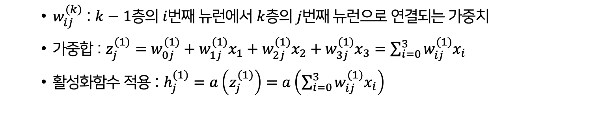
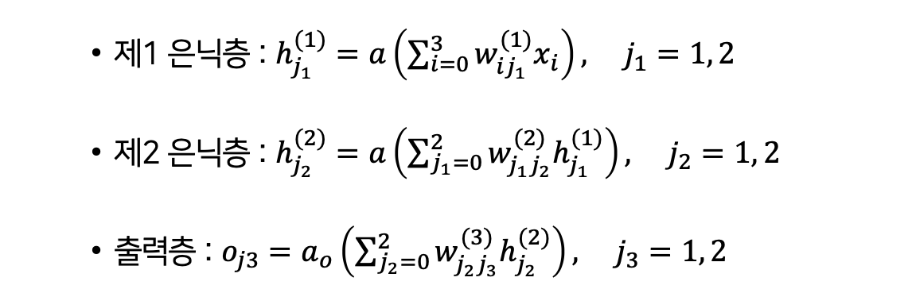
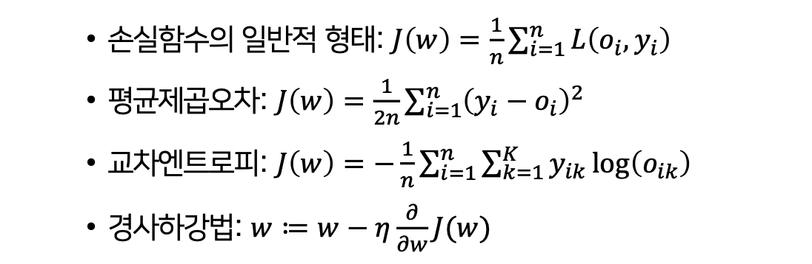
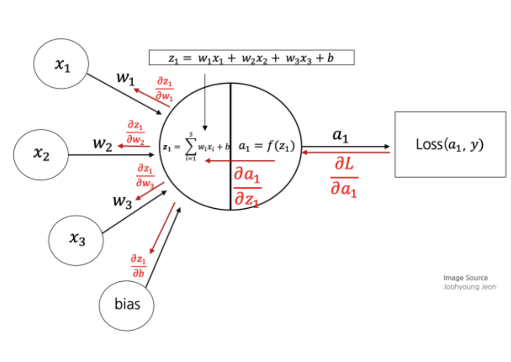
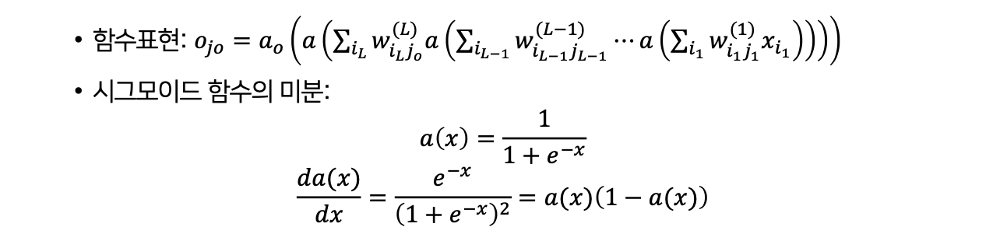

# LEC 3. 딥러닝 모형의 구조와 학습

## 다층신경망

### 다층신경망의 구조


| 구분                    | 내용                                                                          |
| --------------------- | --------------------------------------------------------------------------- |
| **구조**                | 입력층(Input layer) → 은닉층(Hidden layers) → 출력층(Output layer)                   |
| **뉴런 (node, neuron)** | 각 층에서 데이터를 받아 가중치와 더해진 뒤, 활성화함수를 거쳐 다음 층으로 전달하는 단위                          |
| **은닉층**               | 입력과 출력 사이에 위치. 데이터를 여러 번 조합·변환해 더 복잡한 패턴을 학습할 수 있게 함                        |
| **활성화 함수**            | 각 뉴런이 계산된 값을 비선형적으로 변환해 전달 (예: Sigmoid, ReLU, Tanh) → 비선형성을 주어 복잡한 문제 해결 가능 |
| **출력층**               | 최종 예측값을 내는 층. 회귀 문제라면 수치 예측, 분류 문제라면 각 클래스 확률로 출력                           |

### 다층 퍼셉트론(MLP)의 특징
- 은닉층이 1개 이상 있는 신경망 -> 단순 퍼셉트론보다 강력
- 층이 깊을수록 복잡한 패턴 학습 가능 -> 딥러닝(Deep Learning)
- `입력-은닉층-출력층`을 지나면서 `가중치 합+활성화 함수`로 계속 변환

```
MLP는 입력 데이터를 은닉층을 거쳐 비선형 변환하면서 학습하여, 최종적으로 원하는 출력(예측/분류)를 내는 구조
``` 

### 활성화 함수
- 시냅스: 뉴런은 시냅스를 통해 다른 뉴런과 연결됨
- 활성화 함수: 시냅스의 기능을 유사하게 구현하는 함수 

| 함수                                | 수식                                           | 특징                                                                |
| --------------------------------- | -------------------------------------------- | ----------------------------------------------------------------- |
| **항등 함수 (Identity)**              | ( a(x) = x )                                 | 그대로 출력. 회귀 문제에서 사용                                                |
| **시그모이드 (Sigmoid)**               | ( a(x) = \frac{1}{1+e^{-x}} )                | 출력이 (0,1) 범위. 확률처럼 해석 가능. 하지만 기울기(gradient)가 작아져 학습 어려움 (경사소실 문제) |
| **쌍곡탄젠트 (tanh)**                  | ( a(x) = \frac{e^x - e^{-x}}{e^x + e^{-x}} ) | 출력이 (-1,1) 범위. 시그모이드보다 중심이 0이라 학습 안정적. 하지만 여전히 경사소실 문제 있음         |
| **ReLU** (Rectified Linear Unit)  | ( a(x) = \max(0, x) )                        | 0 이하 입력은 0, 양수는 그대로 출력. 연산 단순, 학습 빠름. 현재 가장 널리 사용                 |
| **Leaky ReLU**                    | ( a(x) = \max(\alpha x, x) )                 | ReLU의 단점(0 이하 입력이 모두 0 → 죽은 뉴런 문제)을 보완                            |
| **ELU (Exponential Linear Unit)** | 음수 구간을 완만히 처리                                | Leaky ReLU와 비슷한 아이디어                                              |

- 신경망에서 비선형성을 줘야 층을 깊게 쌓는 효과가 있음 
- 딥러닝 가중치 학습과정에서 발생되는 경사소실 문제로 인해 최근에는 ReLU 함수가 주로 이용됨, 0에서 미분이 불가능하다는 제약 있음


### 다층신경망의 수학적 표현

예시
- 입력층: 뉴런 3개 𝑥1, 𝑥2, 𝑥3
- 은닉층: 2층, 각각 뉴런 2개 h1(1), h2(1), h1(2), h2(2)
- 출력층: 뉴런 2개 o1, o2
    - 구조: [입력 3] → [은닉 2] → [은닉 2] → [출력 2]



### 일반근사정리
- 충분한 크기의 뉴런을 가진 은닉층이 하나 이상 있는 다층 신경망은 모든 연속함수를 근사할 수 있음
- 의미
    - 은닉층 1개, 뉴런이 충분히 많으면 우리가 아는 모든 함수 표현 가능
    - 따라서 신경망이 딥러닝 모델로 발전하는 데 중요한 이론적 근거가 됨
- 심화 내용
    - 은닉층 수가 많아질수록 신경망의 정확도는 높아지는 경향을 보임
    - 층이 깊어질수록 입력 데이터를 더 추상적이고 복잡하게 표현할 수 있어, 데이터의 표현력이 좋아짐
    - 단순히 층별 뉴런 수만 늘린다고 해서 성능이 무조건 크게 향상되지는 않음

## 신경망 학습

### 신경망 학습의 구조
- 가중치들이 갱신되더라도 손실함수가 더 이상 줄지 않는다면 그 가중치들이 최적값이라 판단하고 그 가중치들의 신경망을 활용하게 됨
- 학습된 신경망에 새로운 데이터를 적용하여 구한 결과와 실제값과 비교하여 성과가 좋다면 이를 이용한 각종 서비스를 제공할 수 있음

### 신경망 학습 데이터
- 전체 데이터를 훈련(training), 검증(validation), 시험(test) 데이터로 나눔
    - 훈련 데이터: 신경망 학습에 사용(60%)
    - 검증 데이터: 신경망 선택에 사용(20%)
    - 시험 데이터: 신경망의 성과를 확인하늗 데 사용(20%)

### 손실함수와 신경망 학습
 
 - 가중치의 초기값을 정하는 것이 학습속도를 높이는데 중요
 - 초기값은 주로 0 근처의 작은 값에서 시작
 - 초기값을 너무 큰 값으로 주면 활성화 함수가 제대로 작동하지 않을 수 있음
 - 학습: 경사는 손실함수를 편미분하여 구하는데 이 경사에 따라 일정한 학습률로 가중치를 갱신시켜 나가는 과정

`에포크`
- 한 데이터셋 전체를 1회 학습하는 것
- 에포크 수가 증가할수록 훈련 데이터의 정확도가 증가하고 손실함수는 감소
- 에포크가 커져도 그 손실함수 값이 줄어들지 않고 증가할 수 있음

## 오차역전파법

### 오파역전파법의 개요

`오파역전파법`
 - 신경망 학습을 위한 대표적 알고리즘, **다층 신경망 학습**을 가능하게 함
- 동작 원리
    - 순방향 역산(Forward pass): 입력 데이터를 받아 출력을 계산
    - 손실 계산: 예측값과 실제값을 비교하여 손실함수 값을 구함
    - 역방향 연산(Backward pass): 손실함수를 각 가중치에 대해 미분, 가중치를 손실이 줄어드는 방향으로 갱신
- 특징
    - 연산 과정은 **순방향+역방향** 두 단계로 이루어지 
    - 예측 -> 손실 게산 -> 역전파 -> 가중치 갱신을 반복
    - 누적적으로 가중합과 비선형 연산이 적용된 신경망에 대해, **손실함수의 기울기**를 효율적으로 구할 수 있음
- 구현 관점
    - 은닉층이 많을수록 많은 가중치가 필요 -> 수많은 연쇄미분 계산이 요구됨
    - 순방향 연산 시 미분값을 저장했다가 역전파 때 재활용 -> 연산 효율성 향상
    - 합성함수의 미분, 계산그래프 기법을 적극적으로 활용

### 오차역전파법의 예
- 신경망에서 순전파와 역전파를 반복하면서 손실함수를 줄여나가도록 가중치 갱신
 

 ## 경사소실과 과대적합
 
 ### 경사소실
 다층신경망의 구조
 - 입력변수: x0, x1, ..., xp
 - 출력변수: Oj
 - 제 L 은닉층 뉴런: h(L)j
 - 활성화 함수: a
  

경사소실 문제
- 시그모이드 함수의 기울기가 0.25이하
- 다층 신경망에서 경사가 연쇄적으로 전달되면서 점점 작아짐
- 은닉층 개수가 k개일 경우, 최대 기울기가 = (0.25)^k
- 결과적으로 가중치 변화가 0에 가까워짐 -> 역전파 시 손실함수 변화가 뒤쪽 층까지 전달되지 않음
- 따라서 깊은 신경망에서 가중치가 갱신되지 않는 현상 발생
```
시그모이드 같은 활성화 함수를 사용할 때 다충 구조가 깊어질수록 기울기가 점점 작아져 학습이 멈추는 문제
```

### 과대적합(overfitting)
- 신경망의 층을 깊이 쌓아서 가중치의 수가 많아질 때 발생
- 신경망이 훈련 데이터에는 잘 적합되지만 새로운 데이터에 대한 예측력이 낮은 경우를 의미