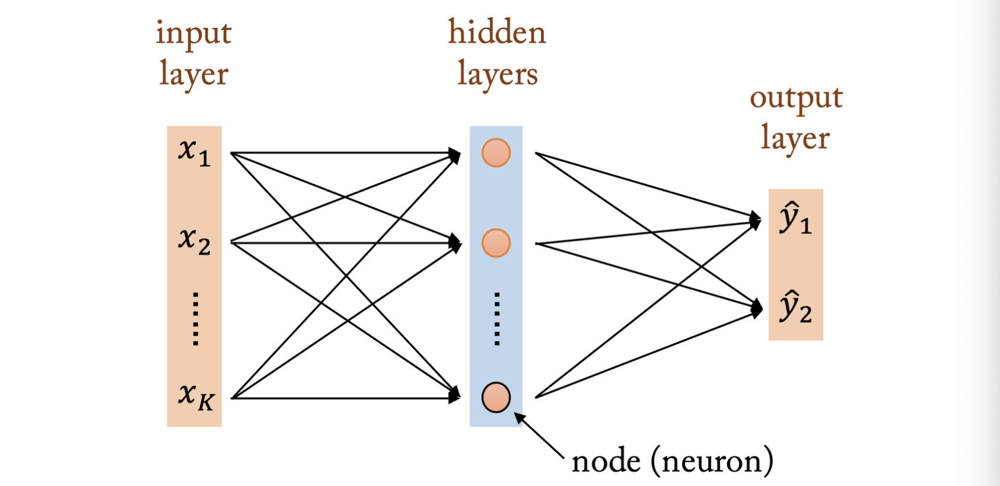

# LEC 3. 딥러닝 모형의 구조와 학습

## 다층신경망

**다층신경망의 구조**


| 구분                    | 내용                                                                          |
| --------------------- | --------------------------------------------------------------------------- |
| **구조**                | 입력층(Input layer) → 은닉층(Hidden layers) → 출력층(Output layer)                   |
| **뉴런 (node, neuron)** | 각 층에서 데이터를 받아 가중치와 더해진 뒤, 활성화함수를 거쳐 다음 층으로 전달하는 단위                          |
| **은닉층**               | 입력과 출력 사이에 위치. 데이터를 여러 번 조합·변환해 더 복잡한 패턴을 학습할 수 있게 함                        |
| **활성화 함수**            | 각 뉴런이 계산된 값을 비선형적으로 변환해 전달 (예: Sigmoid, ReLU, Tanh) → 비선형성을 주어 복잡한 문제 해결 가능 |
| **출력층**               | 최종 예측값을 내는 층. 회귀 문제라면 수치 예측, 분류 문제라면 각 클래스 확률로 출력                           |

**다층 퍼셉트론(MLP)의 특징**
- 은닉층이 1개 이상 있는 신경망 -> 단순 퍼셉트론보다 강력
- 층이 깊을수록 복잡한 패턴 핛브 가능 -> 딥러닝(Deep Learning)
- `입력-은닉층-출력층`을 지나면서 `가중치 합+활성화 함수`로 계속 변환

```
MLP는 입력 데이터를 은닉층을 거쳐 비선형 변환하면서 학습하여, 최종적으로 원하는 출력(예측/분류)를 내는 구조
``` 

**활성화 함수**
- 시냅스: 뉴런은 시냅스를 통해 다른 뉴런과 연결됨
- 활성화 함수: 시냅스의 기능을 유사하게 구현하는 함수 

| 함수                                | 수식                                           | 특징                                                                |
| --------------------------------- | -------------------------------------------- | ----------------------------------------------------------------- |
| **항등 함수 (Identity)**              | ( a(x) = x )                                 | 그대로 출력. 회귀 문제에서 사용                                                |
| **시그모이드 (Sigmoid)**               | ( a(x) = \frac{1}{1+e^{-x}} )                | 출력이 (0,1) 범위. 확률처럼 해석 가능. 하지만 기울기(gradient)가 작아져 학습 어려움 (경사소실 문제) |
| **쌍곡탄젠트 (tanh)**                  | ( a(x) = \frac{e^x - e^{-x}}{e^x + e^{-x}} ) | 출력이 (-1,1) 범위. 시그모이드보다 중심이 0이라 학습 안정적. 하지만 여전히 경사소실 문제 있음         |
| **ReLU** (Rectified Linear Unit)  | ( a(x) = \max(0, x) )                        | 0 이하 입력은 0, 양수는 그대로 출력. 연산 단순, 학습 빠름. 현재 가장 널리 사용                 |
| **Leaky ReLU**                    | ( a(x) = \max(\alpha x, x) )                 | ReLU의 단점(0 이하 입력이 모두 0 → 죽은 뉴런 문제)을 보완                            |
| **ELU (Exponential Linear Unit)** | 음수 구간을 완만히 처리                                | Leaky ReLU와 비슷한 아이디어                                              |

- 신경망에서 비선형성을 줘야 층을 깊게 쌓는 효과가 있음 
- 딥러닝 가중치 학습과정에서 발생되는 경사소실 문제로 인해 최근에는 ReLU 함수가 주로 이용됨, 0에서 미분이 불가능하다는 제약 있음

**다층신경망의 수학적 표현**

예시
- 입력층: 뉴런 3개 𝑥1, 𝑥2, 𝑥3
- 은닉층: 2층, 각각 뉴런 2개 h1(1), h2(1), h1(2), h2(2)
- 출력층: 뉴런 2개 o1, o2
    - 구조: [입력 3] → [은닉 2] → [은닉 2] → [출력 2]