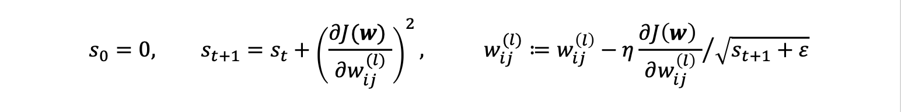
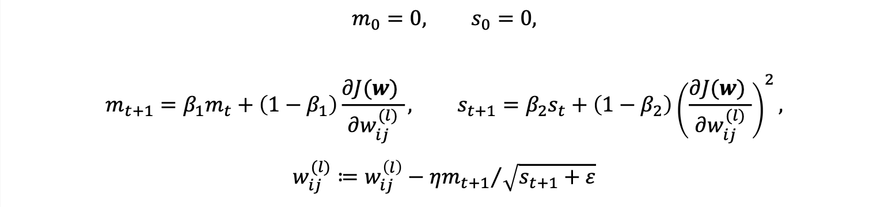
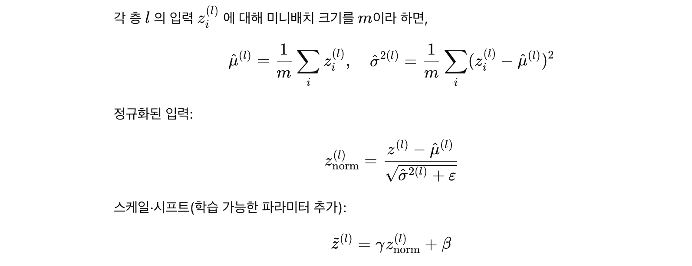

# LEC. 04 딥러닝의 문제와 발전

```
1. 경사소실 문제
2. 초기값 설정 문제
3. 과대적합의 문제
4. 긴 학습시간, 국지적 최적화
```

## 경사소실과 활성화 함수의 선택

### 경사소실 문제 
- 기존 사용하던 활성화 함수(ex. 시그모이드) 문제
    - 입력이 커질수록 미분값이 0에 수렴하여 경사(기울기)가 사라지는 문제 발생 -> 학습이 느려지거나 멈춤
- 문제를 해결하기 위해 ReLU 계열의 함수가 주로 사용됨

| 함수          | 특징                     | 미분 특성                      |
| ----------- | ---------------------- | -------------------------- |
| **Sigmoid** | 0~1 범위, 출력 제한          | 입력이 커질수록 미분값 → 0           |
| **Tanh**    | -1~1 범위, 중심이 0이라 수렴 빠름 | Sigmoid보다 미분 감소 완화         |
| **ReLU**    | 0보다 크면 그대로, 작으면 0      | 0보다 큰 구간의 미분 = 1 → 경사소실 방지 |

- `ReLU`: 계산이 단순하고, 학습 속도가 빠르며 경사소실이 거의 없음

### 변형된 ReLU 함수들 

**1. Parametric ReLU(PReLU)**
- 음수 영역의 기울기 α1을 학습 가능한 파라미터로 둠
    - *CNN 같은 모델에서 미세한 성능 향상, 학습 대상이 늘어나니 추가 파라미터 생김*

**2. Leaky ReLU**
- α₁ = 0.01로 고정된 형태
- ReLU의 단점인 “Dead ReLU(음수 입력 시 완전한 0)” 문제를 완화

**3. ELU(Exponential Linear Unit)**
- 음수 영역에서도 미분 가능하도록 부드럽게 연결
- 평균이 0에 가까워지게 하여 학습 안정화에 도움 

| 함수              | 수식                     | 특징                 |
| --------------- | ---------------------- | ------------------ |
| ReLU            | x if x>0 else 0        | 단순, 빠름, 경사소실 거의 없음 |
| Leaky ReLU      | x if x>0 else 0.01x    | Dead ReLU 완화       |
| Parametric ReLU | x if x>0 else αx       | 음수 영역 기울기 학습       |
| ELU             | x if x>0 else α(e^x-1) | 출력 평균 0, 학습 안정화    |


## 초깃값의 설정

### 심층신뢰망
- 가중치 초기값을 잘 설정하지 않으면 손실함수를 최소화하는 최적값을 찾기 어려움
    - `제한된 볼츠만 머신(RBM)`을 이용하여 좋은 초기값을 학습하는 방법 제시
- 이때부터 다층 신경망을 **딥러닝이**라 부르기 시작

### 제한된 볼츠만 머신(RBM)
- 구조
    - 입력층: v1​,v2​,v3​,v4​
    - 은닉층: h1​,h2​,h3​
    - 출력층 없음
    - 확률 뉴런을 사용 -> 확률적 그래프 모형(GPM)
- 작동 원리
    - 인코더(Encoder): 입력층 -> 은닉층 방향으로 특징 학습
    - 디코더(Decoder): 은닉층 -> 입력층을 재구성
    - KL 발산으로 원래 입력과 재구성된 입력 차이를 최소화 -> 입력층과 유사한 은닉 표현 찾음
    - 비지도학습: 레이블 없어도 데이터 패턴을 자동 학습
- 학습 과정
    - 입력층 -> 은닉층 학습
    - 은닉층을 다시 입력층으로 복원하며 오차 최소화
    - 이 과정을 반복하여 입력 데이터의 분포 근사

### 심층신뢰망(DBN)의 구조 
- 여러 개의 RBM을 층층이 쌓아 올려 구성
    - *첫 번째 RBM: 입력층과 유사한 h(1) 학습*
    - *두 번째 RBM: h(1)을 입력으로 받아 h(2) 학습*
- 이런식으로 계속 쌓아 깊은 신경망(Deep Network) 형성
- 마지막에 출력층을 연결해 다층 신경망(Multi-layer Network) 완성
```
즉, RBM으로 각 층을 미리 학습 -> 전체 네트워크 학습 시 빠르고 안정적
```

### 초기값의 선택(Weight Initialization)

**잘못된 초기화의 문제**
- 모든 가중치를 0으로 초기화하면 모든 뉴런이 같은 계산을 하게 되어 학습 불가능
    - **각 뉴런의 초기값을 임으로 다르게 설정해야 함**

**좋은 초기화 방법**

| 구분             | 방식               | 수식                                                    | 특징                  |
| -------------- | ---------------- | ----------------------------------------------------- | ------------------- |
| **Xavier 초기화** | Sigmoid, Tanh 계열 | N(0, 2/(n_input + n_output)  | 평균 0, 분산 균형 유지      |
| **He 초기화**     | ReLU 계열          | N(0, 4/(n_input + n_output) | ReLU 특성 반영 (양수만 통과) |
- n_input: 이전 층 뉴런 수 / n_output: 다음 층 뉴런 수


### 핵심 요약
| 개념                     | 설명                               |
| ---------------------- | -------------------------------- |
| **심층신뢰망(DBN)**         | 여러 RBM을 층층이 쌓은 신경망, 좋은 초기값 학습 가능 |
| **RBM**                | 확률적 은닉층을 가진 비지도 학습 모델            |
| **Encoder/Decoder 구조** | 입력 재구성 기반의 특징 학습                 |
| **KL 발산**              | 원본과 재구성 차이 측정하여 최적화              |
| **Xavier/He 초기화**      | 함수 종류별로 적절한 분산 설정으로 학습 안정화       |


## 딥러닝 학습의 최적화
```
딥러닝에서 학습은 손실함수를 최소화하도록 가중치를 조정하는 과정
-> 최적화 알고리즘: 가중치를 어떻게 갱신할지 정하는 규칙
```

### 확률적 경사하강법(SGD)

1. 개념
- 전체 데이터를 한 번에 쓰는 대신, 임의로 뽑은 일부데이터(batch)로 경사 계산
- 손실함수가 감소하는 방향으로 가중치 갱신
- **이전 단계의 경사를 기억하지 않음** -> 진동 발생 가능
2. 단점
- 최소값 근처에서 진동
- 최적점 도달 전에 멈추거나 느리게 수렴 가능

### 모멘텀(Momentum) 방법

1. 개념
- 이전 경사값의 영향을 일정 비율(β)로 남겨 진동을 줄이고, 관성 부여
- 속도(momentum)을 이용해 빠르게 수렴
    - 공을 산 위에서 굴릴 때 시간이 지나면서 공이 내려오는 속도가 빨라져 국지적 최소점을 벗어나 가장 최저점에 내려갈 수 있다는 원리 적용


2. 특징

| 항목 | 설명                     |
| -- | ---------------------- |
| β  | 모멘텀 계수 (보통 0.9 사용)     |
| 효과 | 관성 효과로 빠른 수렴, 진동 완화    |
| 비유 | 공이 내리막길에서 관성으로 빠르게 내려감 |

### AdaGrad(Adaptive Gradient)


1. 개념
- 학습률을 자동으로 조절하는 방식
- 초기에는 큰 학습률, 최저점 근처에서는 작은 학습률

2. 단점
- 시간이 지남에 따라 학습률이 지나치게 작아져 학습이 멈출 가능성 있음 

### RMSProp(Root Mean Square Propagation)

1. 개념
- AdaGrad에 지수평활법을 적용하여 성능 개선
- 𝛼=0.9 사용

2. 특징

| 항목 | 설명                                                |
| -- | ------------------------------------------------- |
| α  | 지수평활 계수 (보통 0.9)                                  |
| 장점 | 최근의 경사 정보에 더 큰 가중치를 부여 → **AdaGrad보다 지속적인 학습 가능** |
| 용도 | RNN, LSTM 등에서 자주 사용                               |


### Adam(Adaptive Moment Estimation)


1. 개념
- 모멘텀+RMSProp 결합
- 최적화방법과 별도로 학습률을 학습에 따라 바꿀 수 있음(𝜂 = 𝜂0*10^-t/n)

2. 특징

| 항목 | 설명                                   |
| -- | ------------------------------------ |
| β₁ | 모멘텀 계수 (보통 0.9)                      |
| β₂ | RMS 계수 (보통 0.999)                    |
| ε  | 수치 안정성용 상수 (10⁻⁸)                    |
| 장점 | 빠른 수렴 + 안정적 학습 + 자동 학습률 조절           |
| 비유 | RMSProp의 “적응적 학습률” + 모멘텀의 “관성” 효과 결합 |

### 알고리즘별 특징 비교

| 방법           | 학습률 조절    | 이전 경사 반영 | 장점           | 단점            |
| ------------ | --------- | -------- | ------------ | ------------- |
| **SGD**      | 고정        | X        | 단순, 빠름       | 진동, 느린 수렴     |
| **Momentum** | 고정        | ✅        | 빠른 수렴, 관성 효과 | 최적점 초과 이동 가능  |
| **AdaGrad**  | 감소      | X        | 자동 학습률 조절    | 너무 빨리 학습률 감소  |
| **RMSProp**  | 지속 조절   | X        | AdaGrad 개선   | 하이퍼파라미터 튜닝 필요 |
| **Adam**     | 적응형     | ✅        | 빠르고 안정적    | 메모리 사용량 ↑     |

## 편의와 분산

### 편의(bias)와 분산(variance)

```
통계학과 머신러닝 모두에서 모델의 일반화 능력을 설명하는 핵심 개념 \
```

1. 개념

| 구분               | 의미                         | 수식적 해석       | 현상                            |
| ---------------- | -------------------------- | ------------ | ----------------------------- |
| **편의(Bias)**     | 모델의 예측값 평균이 실제 정답과 얼마나 다른가 | 예측값 평균 – 실제값 | 편의 ↑ → **과소적합(Underfitting)** |
| **분산(Variance)** | 모델 예측값들이 서로 얼마나 흩어져 있는가    | 예측값 – 예측값 평균 | 분산 ↑ → **과대적합(Overfitting)**  |

2. 수학적 표현

- p = 1: 단순션형회귀 -> 비선형 부분을 포착 못해 높은 편의
- p가 너무 큼 -> 훈련 데이터에 과하게 맞춰 높은 분산

3. 요약
- 모델 편향이 클 때: 모델이 단순해서 데이터 패턴을 제대로 못 잡음(under fitting)
- 모델 분산이 클 때: 모델이 너무 복잡해서 훈련 데이터에면 과하게 적합(over fitting)
    - 좋은 모델은 편향과 분산의 균형점을 찾는 것

### 과소적합과 과대적합 
1. 과소적합(under fitting)
- 특징
    - 모델이 너무 단순해서 데이터의 패턴을 충분히 학습하지 못한 상태
    - 훈련 데이터에서도 성능이 낮음
    - 편향이 큼 -> 데이터의 복잡한 비선형 관계를 잡지 못함 
- 원인
    - 신경망 구조가 너무 얕음(layer 수 적음)
    - 학습 epoch가 너무 적음
    - 정규화가 너무 강함

2. 과대적합(over fitting)
- 특징
    - 훈련 데이터에서는 오차가 매우 낮은데 시험 데이터에서는 높음
    - 분산이 큼 -> 모델이 불안정하고, 데이터에 민감
- 원인
    - 모델이 너무 복잡함
    - 데이터 수가 부족
    - 학습 epochs가 너무 많음
- 해결 방법
    - 모델 단순화(층 수 줄이기, 뉴런 수 감소)
    - 정규화 적용: L1, L2 정규화 / Dropout / Early Stopping
    - 교차 검증 활용

## 과대적합의 해소방법
```
훈련데이터를 추가하거나 모형을 단순화하면 됨
-> 조기학습종료 / 정칙화 / 드롭아웃 / 데이터 증강 / 배치 정규화
```

### 조기학습종료
1. 원리
- 학습이 진행될수록 훈련 데이터의 손실은 계속 감소하지만, 검증 데이터의 손실은 일정 시점 이후 증가하기 시작
    - 즉, 모델이 기존 데이터의 오차를 외우기 시작하는 시점 발생 -> 이 시점에서 학습 중단

2. 특징
- 조기학습종료 시점이 진짜 최소점은 아닐 수도 있음
- 데이터가 부족하거나 잡음이 많을 경우 가장 간단하면서 효과적인 과대적합 방지 방법

### 정칙화(Regularizaion)
1. 원리
- 모델이 너무 복잡해지는 것을 방지하기 위해, 손실함수에 가중치 크기에 대한 패널티 적용
    - 단순하고 일반화 가능한 모델 유도

2. 수학적 표현

- L2 정칙화(Ridge)
    - 가중치의 제곱합에 패널티 부여
    - 큰 가중치에 더 큰 벌점을 줌 -> 가중치가 커지지 않도록 억제
    - 가중치 전체를 작게 유지
    - 가중치가 0에 근접하지만 완전히 0이 되지는 않음 
    - 모델을 부드럽게 만들어 일반화 성능 향상 
- L1 정칙화(Lasso)
    - 가중치의 절댓값 합에 패널티 부여
    - 가중치 중 일부를 0으로 만듦 -> 불필요한 변수 제거 효과
    - 변수가 많을 때 유용 

3. λ (람다, Regularization Strength)
- 정칙화 강도를 조절하는 하이퍼파라미터
- λ가 커질수록 패널티 커짐 -> 가중치 작아짐

| λ 크기 | 모델 복잡도 | 특징      |
| ---- | ------ | ------- |
| 작을 때 | 복잡한 모델 | 과대적합 위험 |
| 클 때  | 단순한 모델 | 과소적합 위험 |


### 드롭아웃(Dropout)

1. 작동 원리
- 입력층부터 은닉층 사이의 뉴런 중 일부를 무작위로 끊어냄
- 각 미니배치마다 제거되는 뉴런이 달라짐 -> 매번 다른 신경망 구조로 학습되는 효과(앙상블과 유사)
- 학습 후에는 모든 뉴런을 복원하되, 학습 시 제거 비율을 고려해 가중치를 스케일링 함 

2. 효과

| 항목             | 설명                               |
| -------------- | -------------------------------- |
| **과대적합 완화**    | 특정 뉴런이나 가중치에 의존하지 않게 만듦          |
| **일반화 성능 향상**  | 다양한 신경망을 동시에 학습하는 효과             |
| **앙상블 효과**     | 여러 신경망을 평균낸 모델처럼 동작              |
| **L₁ 정칙화와 유사** | 일부 가중치를 0으로 만들어 희소성(sparsity) 유도 |

3. 특징
- 손실함수가 정확히 정의되지 않음 -> Dropout 적용 시 손실 감수 여부 명확하지 않음
- 뉴런 수가 적은 층에는 적용하지 않는 경우 있음
- 학습 속도가 느려질 수 있음, 너무 큰 드롭아웃은 학습 저하 초래

### 데이터 증강

1. 정의
- 학습 데이터를 인위적으로 변형·조작하여 데이터 양을 늘리고 모델의 일반화 성능을 향상시키는 기법
- 이미지는 좌우반전, 스케일링, 회전 등으로 증강

2. 효과
- 과대적합 방지: 모델이 데이터의 특정 패턴에 과도하게 의존하지 않음
- 일반화 성능 향상
- 데이터 효율 향상 

### 배치 정규화(Batch Normalization)
```
각 층(layer)의 입력값을 미니배치 단위로 정규화하여 학습의 안정성과 속도를 높이는 방법
```

1. 배경
- 딥러닝에서 입력값의 평균이 너무 크거나 작으면 활성화 함수의 기울기가 0에 가까워져 학습 어려움
    - 시그모이드, tanh의 경우 입력값이 +-2를 벗어나면 경사 소실 발생
    - ReLU의 경우 음수 입력시 0으로 죽어버리는 문제 존재
- 각 층의 입력 분포를 **정규화**시켜 학습 안정화

2. 수식적 원리

- γ: 스케일 조정 계수
- β: 이동(shift) 계수
- ε: 0으로 나누는 오류 방지용 작은 상수

3. 전체 흐름

- 각 층에서 **가중합 -> 스케일/시프트 -> 활성화 함수 순**으로 진행

4. 주요 특징
- 학습 안정화: 입력값의 분포가 일정하게 유지되어 경사 폭주/소실 방지
- 빠른 수렴 속도: 높은 학습률 사용 가능 
- 초기값 의존도 낮음: 가중치 초기갑이 달라도 안정적인 학습 가능
- 정규화 효과: Dropout이나 L2 정칙화처럼 과대적합 방지에 도움
- 각 층마다 적용

5. 한계
- 미니배치 의존성: 배치 크기가 작으면평균·분산 추정이 불안정
- 추가 연산량 증가
- RNN에 부적합: 시퀀스 길이가 가변적이여서 적용 어려움 -> LayerNorm 사용 

### 하이퍼파라미터의 최적화
```
신경망을 학습하기 전에 사용자가 직접 설정해야 하는 값(모수, hyperparameter)을 효율적으로 탐색하여 최적의 모델 성능을 내도록 하는 과정
```

1. 하이퍼파라미터란?
- 모델이 학습을 통해 스스로 찾는 가중치(weight)와 달리, 사용자가 직접 지정해야 하는 설정값

| 구분           | 예시                                   | 역할                |
| ------------ | ------------------------------------ | ----------------- |
| **학습 관련**    | 학습률(η), 배치 크기, 최적화 알고리즘(SGD, Adam 등) | 학습 속도 및 수렴 안정성 조절 |
| **모델 구조 관련** | 은닉층 개수, 뉴런 수, 활성화 함수                 | 모델 복잡도 조절         |
| **정규화 관련**   | Dropout 비율, λ (정칙화 계수)               | 과대적합 제어           |
| **데이터 관련**   | 데이터 증강 비율, 샘플링 전략                    | 일반화 성능 향상         |


2. 하이퍼파라미터 탐색의 필요성
- 딥러닝은 하이퍼파라미터에 매우 민감 -> 학습률이나 은닉층 수만 달라도 성능이 크게 변동
- 하이퍼파라미터의 조합 수가 많을수록 탐색 공간이 기하급수적으로 증가

3. 주요 탐색 기법

| 방법                        | 설명                                 | 장점            | 단점            |
| ------------------------- | ---------------------------------- | ------------- | ------------- |
| **Grid Search**           | 미리 정한 값들의 모든 조합을 탐색                | 단순, 구현 쉬움     | 계산량 많고 비효율적   |
| **Random Search**         | 범위 내 무작위로 값을 샘플링                   | 효율적, 빠름       | 일부 영역만 탐색 가능  |
| **Bayesian Optimization** | 이전 탐색 결과를 이용해 다음 탐색 위치를 예측 (확률 기반) | 고성능, 탐색 효율 높음 | 구현 복잡, 계산량 많음 |
| **Hyperband / Optuna 등**  | 비효율적 탐색을 조기 종료하고 유망한 후보만 계속 탐색     | 자원 절약         | 구현 복잡         |

4. 최적화 전략의 실제 적용
- 1단계: 거친 탐색(Coarse Search)
    - 넓은 범위에서 무작위 탐색
    - 대략적인 최적 범위 파악
- 2단계: 세밀 탐색
    - 1단계 결과 기반으로 범위를 축소
    - Grid Search 또는 Bayesian Optimization으로 세밀 조정

 5. 하이퍼파라미터 최적화 시 유의점
 - 모델 검증용 데이터를 반드시 사용
 - 탐색 대상의 우선순위 정하기: 학습률(η) → 정규화 계수(λ) → 배치 크기 순으로 조정하는 것이 일반적
 - 리소스 제약 고려