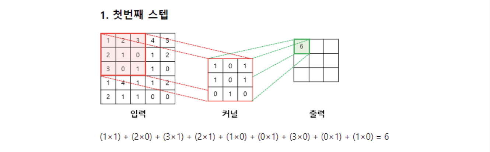
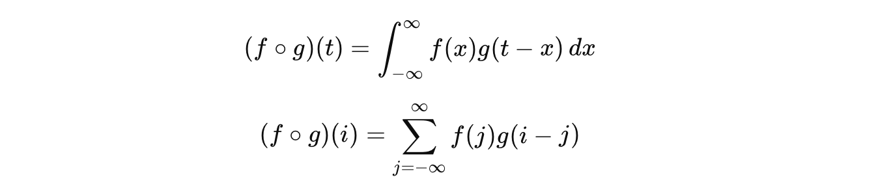
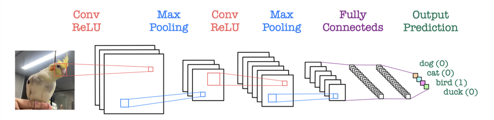

# 합성곱신경망의 기초

## 컴퓨터 비전과 디지털 이미지

### 1. 아날로그 vs 디지털
- 자연의 영상·음성 → 연속적인 아날로그 데이터
- 컴퓨터의 이미지 → 0과 1로 이루어진 디지털 데이터
- 변환 과정
    - 카메라 렌즈가 빛을 받아 이미지 센서가 반사된 양을 감지
    - 전압 변화에 따라 아날로그 신호를 디지털 신호로 변환

### 2. 샘플링(sampling)과 해상도
- 아날로그 데이터는 연속형 신호
    - 이를 **일정ㅇ 간격으로 추출하는 과정**이 샘플링
- 샘플링 간격이 좁을수록 화소(픽셀) 수 증가 -> 고해상도 *ex) 8비트 이미지 데이터 -> 2^8 단계의 명암 표현*

### 컴퓨터 비전
- 컴퓨터에 저장되어 있는 단일 이미지 또는 일련의 이미지인 동영상으로부터 유용한 정보를 추출, 분석, 이해할 수 있는 것

## 합성곱신경망의 역사

### 이미지 처리의 문제
- 고해상도 이미지의 경우 완전연결 신경망(FCN)을 적용하면 가중치 수가 수백억 개에 달함  
    - **과적합** 문제 발생
- 시각 자극을 인식할 때 모든 뉴런이 아닌 특정 영역의 뉴런만 활성화되는 것에서 영감을 얻음
    - `CNN(Convolutional Neural Network)`

### 합성곱신경망(Convolutional Neural Network, CNN)
1. 정의
- 가중치를 공유(weightin sharing)하며, 근처 뉴런들에 대해서만 이동하며 연산
2. 특징
- 완전연결 신경망보다 훨씬 희소한 연결
- 파라미터 수 대폭 감소 -> 계산 효율 증가 및 과적합 감소

### CNN의 발전과 대표 모델
- 1998년 LeCun 연구팀 → LeNet-5 제안
    - 최초의 실용적 합성곱신경망
    - 손글씨 숫자 인식(MNIST)에 적용

- 이후 발전된 대표 CNN 모델들:
    - AlexNet (2012) – GPU 기반, ReLU·Dropout 도입
    - GoogLeNet (2014) – Inception 구조
    - VGGNet (2014) – 단순한 3×3 필터 반복 구조
    - ResNet (2015) – 잔차 연결(Residual connection) 도입

## 합성곱 연산

### 합성곱 연산(Convolution Operation)
- 필터(filter, kernel)를 입력 데이터에 원소 단위로 곱해가며 한 칸씩 위아래, 좌우로 이동(slide)하면서 연산하는 과정

### 합성곱 필터와 이미지
1. 역할
- 합성곱 필터는 이미지의 특징을 추출하는도구
    - 필터 종류에 따라 엣지(경계선), 블러, 선명화 등 다양한 효과 가능
- CNN은 이런 필터를 학습하면서 자동으로 특징 추출

2. 합성곱의 수식 표현

- f: 입력 데이터 (Input image)
- g: 필터 (Kernel)

3. 필터 종륭 예시

| Operation      | Filter                                      | 효과         |
| -------------- | ------------------------------------------- | ---------- |
| Identity       | [[0,0,0],[0,1,0],[0,0,0]]                   | 원본 유지      |
| Edge detection | [[1,0,-1],[0,0,0],[-1,0,1]]                 | 경계선 추출     |
| Sharpen        | [[0,-1,0],[-1,5,-1],[0,-1,0]]               | 선명화        |
| Box blur       | [[1/9,1/9,1/9],[1/9,1/9,1/9],[1/9,1/9,1/9]] | 평균 블러      |
| Gaussian blur  | [[1,2,1],[2,4,2],[1,2,1]]/16                | 부드러운 흐림 효과 |

### 패딩(Padding)
1. 필요성
- 합성곱 연산을 반복하면 출력 크기가 점점 작아짐
    *- ex) 8×8 입력 → 3×3 필터 적용 → 6×6 출력, 다시 3×3 필터 적용 → 4×4 출력*
- 입력과 출력의 크기를 동일하게 유지하려면, 입력 외곽에 0을 추가하는 패딩(padding) 이 필요

2. 역할
- 입력 테두리의 픽셀은 필터 적용 시 활용 빈도 낮아짐, 중앙부는 여러 번 중복 계산됨
- 패딩을 통해 테두리 데이터도 고려 가능 -> 정보 손실 방지

| 구분                                 | 의미              | 효과           |
| ---------------------------------- | --------------- | ------------ |
| **Zero padding**                   | 입력 주변에 0 추가     | 크기 유지, 정보 보존 |
| **Valid convolution (No padding)** | 패딩 없이 연산        | 크기 축소        |
| **Same convolution**               | 패딩으로 크기 동일하게 유지 | CNN에서 일반적    |

### 스트라이드(Stride)
1. 개념
- 스트라이드(Stride): 필터가 이동하는 칸 수(step size)
- 스트라이드가 커질수록 출력 크기가 작아짐

### 컬러 이미지에 대한 합성곱 연산
1. RGB 채널 처리
- 컬러 이미지는 R(적색), G(녹색), B(청색) 3채널로 구성
- 필터를 R, G, B별로 따로 적용 → 필터 수 = 3개
- 각 채널별 합성곱 결과를 더해서 최종 출력(feature map) 생성

### 1x1 합성곱 연산
- 입력: 32×32×12 → 필터: 1×1×12 → 16개 적용 -> 출력: 32×32×16
- 1×1 필터는 각 위치에서 채널 간 결합(weight mixing) 을 수행
- GoogLeNet, ResNet 등에서 계산량 감소 및 모델 압축에 사용

| 장점     | 설명                       |
| ------ | ------------------------ |
| 계산량 감소 | 큰 필터(3×3, 5×5) 대신 1×1 사용 |
| 채널 결합  | 공간 정보 유지하며 채널 간 상호작용 강화  |

### 풀링(Pooling)
1. 정의
- 이미지의 크기를 줄이는 연산 -> Down Sampling
- 주로 합성곱층 뒤에 위치

2. 효과
- 위치 이동·왜곡에도 강함 (translation invariance)
- 계산량 적음, 과적합 적음
- 이미지의 중요한 특징만 남김

### 합성곱 연산의 특성
1. CNN이 잘 작동하는 이유
- 이미지 인식·분류에 탁월
- 합성곱의 희소성, 이동 등변성, 국지 연결성 덕분

| 특성                                   | 의미                         |
| ------------------------------------ | -------------------------- |
| **희소 연결(sparse connectivity)**       | 모든 뉴런 연결 X, 이웃만 연결 → 복잡도 ↓ |
| **가중치 공유(weight sharing)**           | 동일 필터를 여러 위치에 사용 → 효율 ↑    |
| **이동 등변성(translation equivariance)** | 입력이 이동하면 출력도 동일하게 이동       |
| **국지 연결성(local connectivity)**       | 한 필터가 좁은 영역만 관찰            |

2. 계층적 특징 학습
- 여러 합성곱 필터를 반복 적용
    - 하위층: 에지·점 등 단순 특징
    - 상위층: 형태·패턴 등 복잡 특징

## Summary
- Stride → 필터 이동 거리
- Padding → 크기 유지
- Pooling → 크기 축소 + 과적합 방지
- 1×1 Conv → 채널 결합 및 계산량 감소
- Convolution 특징 → 희소성, 이동 등변성, 국지 연결성
    - CNN은 이러한 구조 덕분에 이미지의 계층적 패턴을 자동으로 학습함

## 합성곱 신경망의 기본 구조(CNN Architecture)

### CNN의 구조 개요
- 구성: 합성곱(Convolution) → 활성화(ReLU 등) → 풀링(Pooling) → 완전연결층(FC)
- 역할: 합성곱으로 특징(feature) 을 추출하고, 완전연결층으로 분류(Classification) 수행

- 이미지 입력 후, 이러한 반복 과정을 통해 사과, 배, 고양이, 개 등 다양한 객체를 인식하도록 학습

### 합성곱 신경망의 구조와 학습
1. 학습 방식
- 풀링층 제외 모든 층의 가중치는 일반 신경망과 동일하게 오차역전파법(backpropagation)으로 갱신
    - 학습 전: 필터는 임의의 초기값(random)
    - 학습 후: 데이터의 특징에 따라 필터 값이 변화
- 각 필터마다 특징적인 패턴(모서리, 색상, 질감 등)을 갖게 됨

2. 역전파 시 주의점
- 풀링층의 경우 최대값(max value)을 제외한 나머지 위치의 정보는 손실
- 역전파 시 업 샘플링(up sampling) 수행:
    - 최대값이 있던 위치 -> 1
    - 나머지 위치 -> 0

### LeNet-5 구조
1. 개요
- 최초의 합성곱신경망(CNN) 모델
- 입력 이미지를 여러 합성곱·풀링 층으로 특징을 추출 후, 완전연결층으로 숫자를 분류

| 층              | 특성맵 수 | 출력 크기 | 커널 크기 | 스트라이드 | 활성화 함수                      |
| -------------- | ----- | ----- | ----- | ----- | --------------------------- |
| **입력**         | 1     | 32×32 | -     | -     | -                           |
| **Con1 (합성곱)** | 6     | 28×28 | 5×5   | 1     | tanh                        |
| **P1 (평균 풀링)** | 6     | 14×14 | 2×2   | 2     | tanh                        |
| **Con2 (합성곱)** | 16    | 10×10 | 5×5   | 1     | tanh                        |
| **P2 (평균 풀링)** | 16    | 5×5   | 2×2   | 2     | tanh                        |
| **Con3 (합성곱)** | 120   | 1×1   | 5×5   | 1     | tanh                        |
| **FC (완전연결)**  | -     | 84    | -     | -     | tanh                        |
| **출력층**        | -     | 10    | -     | -     | RBF (Radial Basis Function) |

2. 특징
- CNN의 핵심 구조 원형
    → 합성곱 → 풀링 → 완전연결층 의 기본 틀 확립
- 활성화 함수: ReLU가 아닌 tanh 사용
- 출력층: RBF를 사용하여 클래스별 확률 산출
- 이후의 AlexNet, VGG, ResNet 등 CNN 발전의 기초가 됨